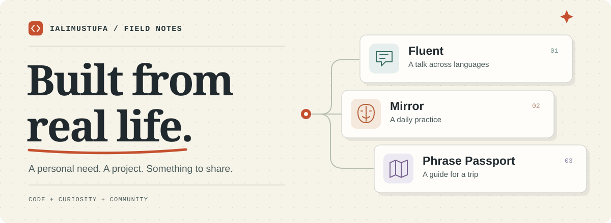
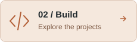
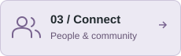

<!-- Upload this README and the assets/ folder together to ialimustufa/ialimustufa. -->

<picture>
  <source media="(max-width: 600px)" srcset="./assets/workbench-mobile.svg" />
  
</picture>

# Hey, I’m Ali 👋

I’m a developer from Mumbai. I build AI apps, teach Python and APIs, and help run developer communities.

Most of my projects start with something I need: translating a talk, tracking my facial exercises, or finding the right words while travelling. Building them gives me plenty to learn—and plenty to teach.

You’ll find some of those projects here, alongside courses and workshop code. Ask questions, point out confusing bits, or show me what you’ve built.

  
  
  
  

### What brings you here?

  
  
  

## 📓 Learn by doing

- 🐍 **[Python Crash Course](https://ialimustufa.github.io/python-crash-course/)** — Eight Colab notebooks, from first program to data preparation. [Code ↗](https://github.com/ialimustufa/python-crash-course)
- 🔌 **[API Engineering](https://ialimustufa.github.io/API/)** — Build, test, and deploy APIs with Python and FastAPI. [Code ↗](https://github.com/ialimustufa/API)

## 🛠️ From a personal need to a project

🎙️ **Fluent** — Live translated audio, captions, and synced slides for presentations.  
[Try it ↗](https://fluent.alimustufa.com) · [Code](https://github.com/ialimustufa/fluent-live-oss)

🪞 **Mirror** — Facial-exercise tracking for personal practice, not medical care.  
[Try it ↗](https://mirror.alimustufa.com/try) · [Code](https://github.com/ialimustufa/mirror-for-bells-palsy)

🧭 **Phrase Passport** — Travel phrases, pronunciation audio, and guides you can save offline.  
[Try it ↗](https://passport.alimustufa.com) · [Build story](https://alimustufa.com/projects/passport/)

## 🫶 Better with people

I’m a founding organiser of **TensorFlow User Group Mumbai**, part of **AI Mumbai**, and lead **GitHub User Group Mumbai**.

I teach at colleges, meetups, and conferences. I like sessions where people can ask an awkward question, try something, and change their mind.

[Talks and workshops ↗](https://alimustufa.com/speaking/)

---

### Got a question, a bug, or something you built?

Open an issue in the relevant repository with what you tried and where you got stuck. For collaborations, community sessions, or workshops, [get in touch](https://alimustufa.com/contact/).

Made in Mumbai. Shared with you.
